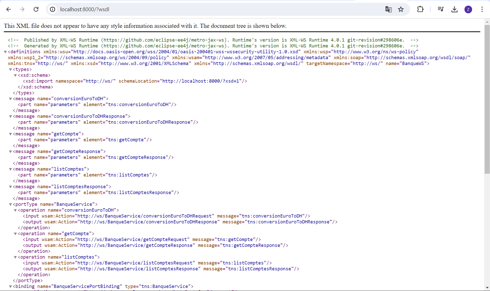

# Activité Pratique 5 : Web services SOAP

## Create a SOAP Web Service

```java
@WebService(serviceName = "BanqueWS")
public class BanqueService {

  @WebMethod(operationName = "conversionEuroToDh")
  public double conversionEuroToDh(@WebParam(name = "montant") double montant) {
    return montant * 11;
  }

  @WebMethod(operationName = "getCompte")
  public Compte getCompte(@WebParam(name = "code") int code) {
    return new Compte(code, Math.random() * 8000, new Date());
  }

  @WebMethod(operationName = "getComptes")
  public List<Compte> getComptes() {
    return List.of(new Compte(1, Math.random() * 8000, new Date()),
        new Compte(2, Math.random() * 8000, new Date()));
  }

}
```

## Test Web Service avec SOAP-UI



## Create a SOAP Web Service Client

```java
public class BanqueClient {

  public static void main(String[] args) {
    BanqueWS service = new BanqueWSService().getBanqueWSPort();
    System.out.println(service.conversionEuroToDh(800));
    System.out.println(service.getCompte(1));
    service.getComptes().forEach(System.out::println);
  }

}
```
